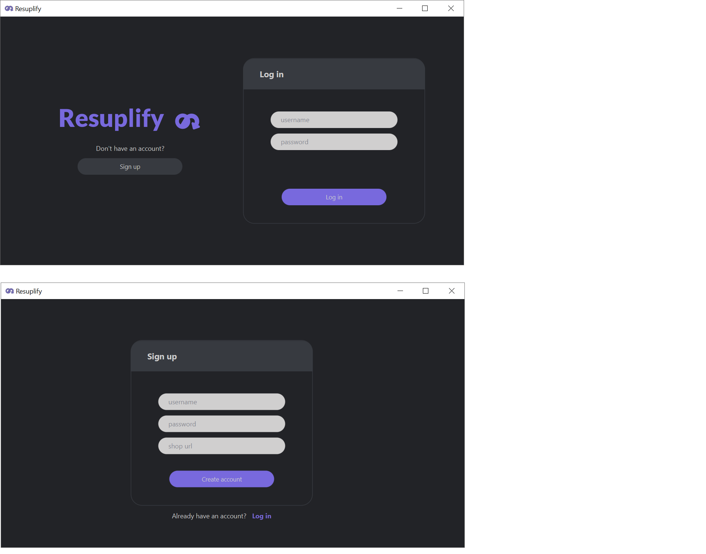
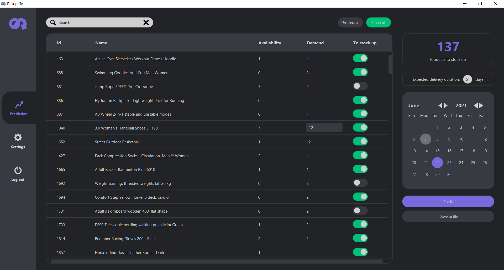
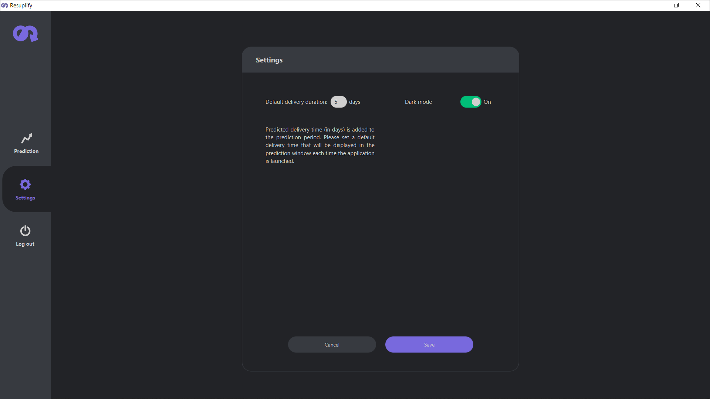
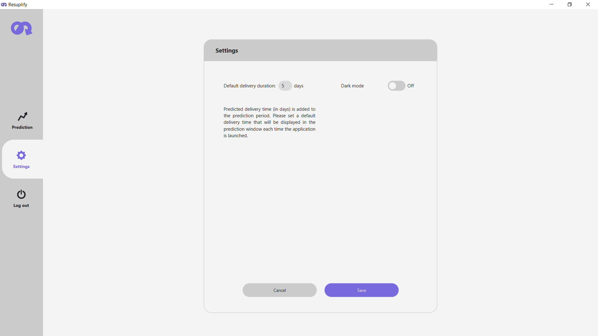
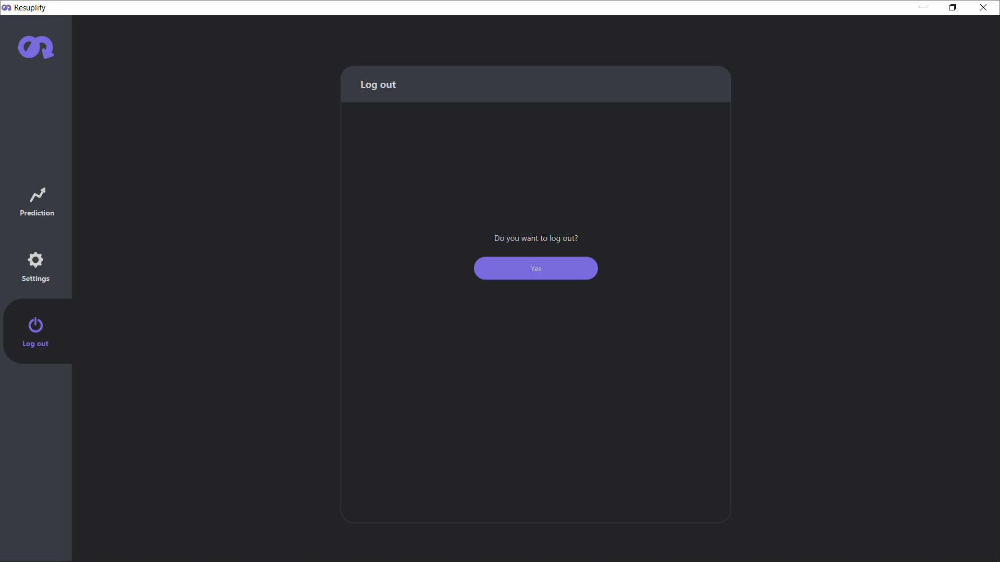

# Resuplify
> Provides the results of the inventory level predictions obtained from Resuplify API

## General information
- Suggests how many products an entrepreneur should buy to have enough products until declared re-order date
- An account on an e-commerce platform [_Shoper_](https://www.shoper.pl/) is required to register in Resuplify
- Project created for Bachelor's thesis

## Technologies used
- JavaFX
- Java 11
- CSS

## Features
- Changing the predicted number of products for purchase
- Excluding products from performed prediction
- Setting expected delivery duration included in predictions
- Saving prediction results to file (.csv, .txt, .xls, .xlsx)
- Switching between dark/light mode

## Screenshots

